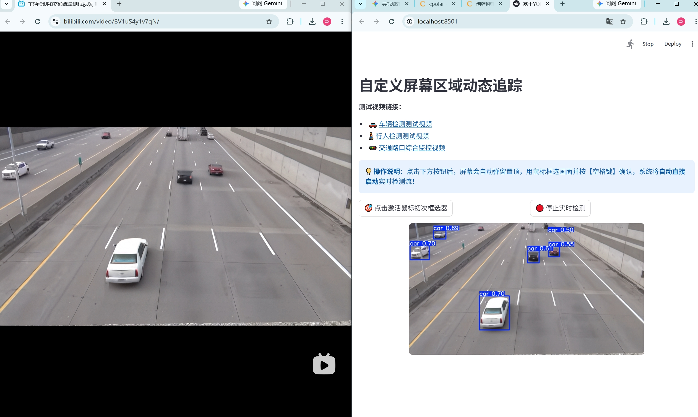
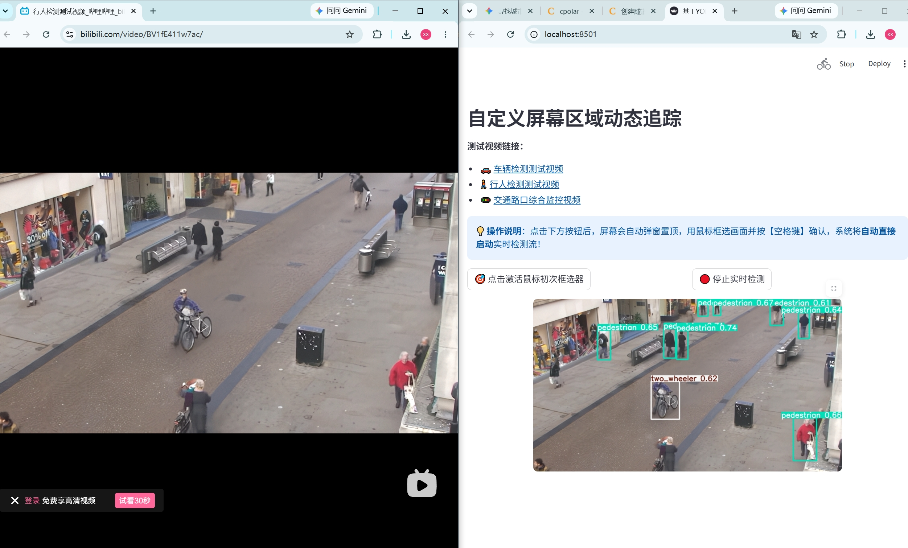
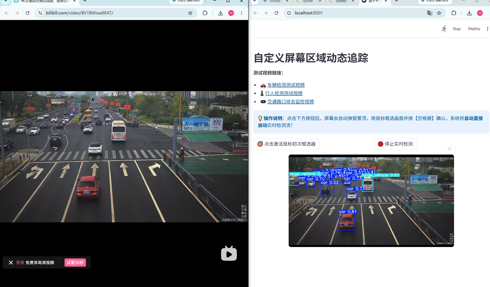

# 🚦 基于 YOLOv5 的城市道路车辆类别与行人检测系统

本项目基于 **YOLOv5** 深度学习目标检测框架构建，针对城市交通场景下的 **小型汽车 (car)**、**大型车辆 (large_vehicle)**、**两轮车 (two_wheeler)** 及 **行人 (pedestrian)** 实现高效多目标精准识别与追踪。系统搭配 Streamlit 可视化 Web 界面，支持图片、视频及屏幕实时区域追踪。

---

## 📷 系统实际运行效果图

以下截图为系统在 Web 端实时推理与追踪的**实际运行效果图**（相关图片存于 `test_images/` 目录）：

| 效果图一 | 效果图二 | 效果图三|
| :---: | :---: | :---: |
|  |  |  |

> 💡 **效果说明**：
> * **图片 1**：演示系统对多车道高密度车流的识别能力，能够清晰框选小型汽车与大型车辆。
> * **图片 2**：演示对路口复杂场景下行人、两轮车等小目标的精准捕捉与分类。
> * **图片 3**：演示系统利用“屏幕任意区域实时追踪”功能，框选网页播放器画面进行高帧率实时推理的效果。

---

## 🌟 核心功能亮点

1. **📸 静态图像 / 文件夹检测**：支持上传单张交通照片或批量导入图片文件夹，实现多目标特征提取与可视化框选。
2. **🎬 离线视频逐帧推理**：支持上传路口监控视频流，进行流畅的逐帧检测与渲染展示。
3. **🖥️ 屏幕任意区域实时追踪**：支持自定义框选电脑屏幕的物理区域（如播放网页视频、监控直播流），实现无缝高帧率同步推理。

---

## 📁 项目目录结构

```text
yolov5-traffic-detection/
├── 1、traffic_dataset (样图)/ # 交通场景训练/测试数据集样例
├── 2、配置文件/                # 数据集配置文件 (traffic_data.yaml) 与模型结构配置
├── 3、训练脚本/                # 模型训练脚本 (train.py) 与 Web 交互主程序 (web_test.py)
├── 4、权重文件/                # 训练好的模型权重 (.pt) 及性能评价曲线图
├── test_images/              # 存放系统实际运行效果截图 (test1~3.jpg)
├── .gitignore                # Git 忽略文件配置
├── LICENSE                   # 开源许可协议 (MIT)
├── README.md                 # 项目说明文档
└── requirements.txt          # 项目依赖库清单
